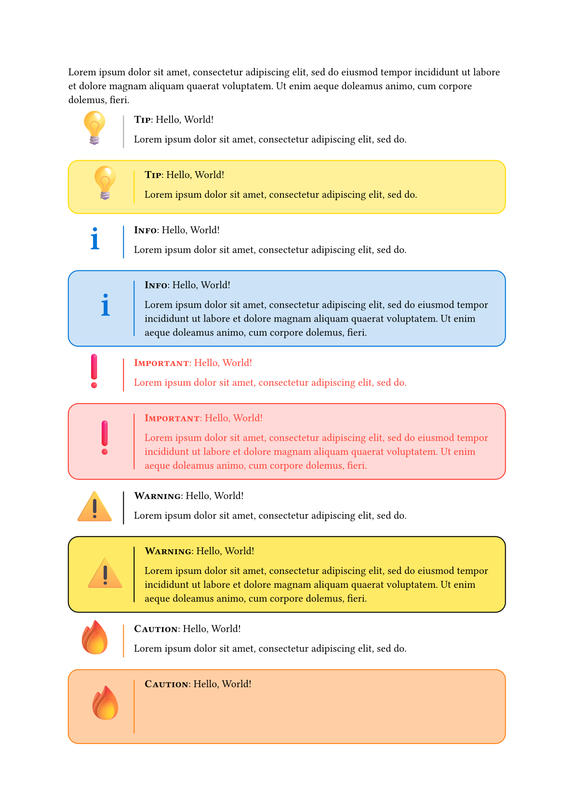
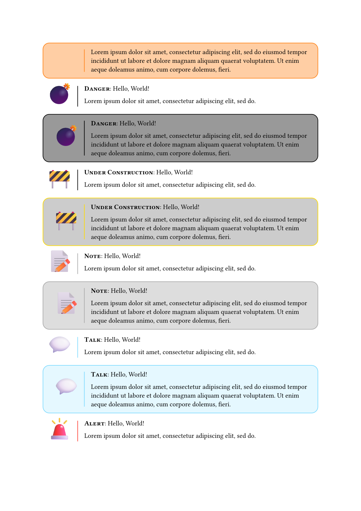
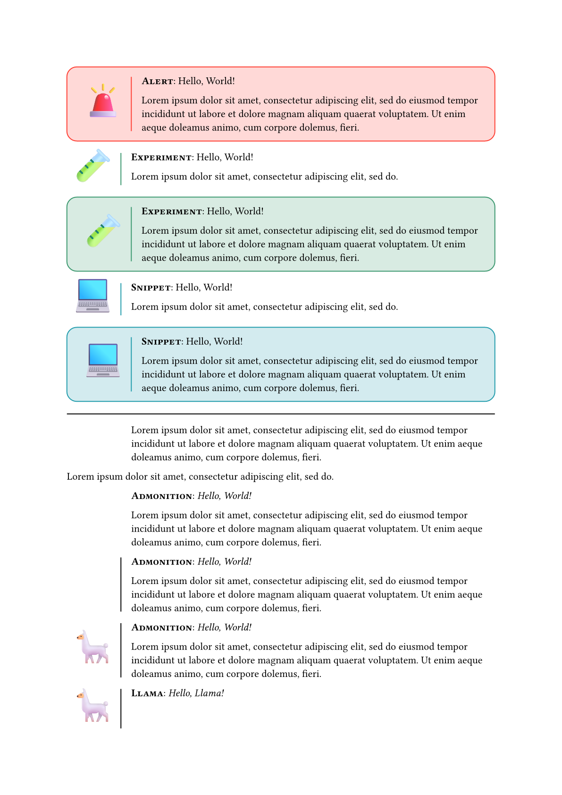
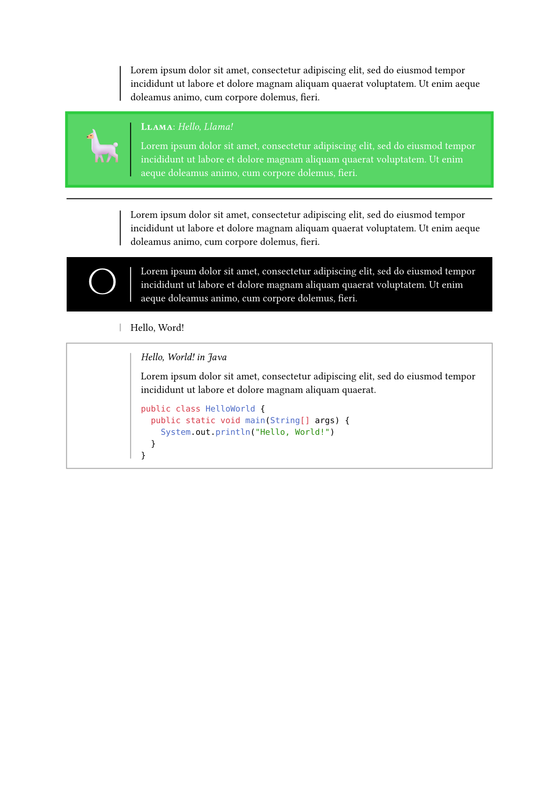
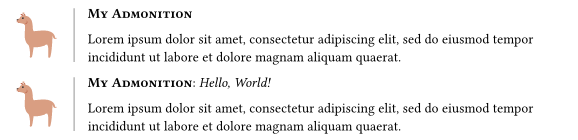
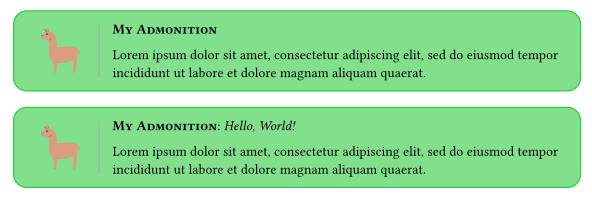

# Asciidoctor-like Admonitions for Typst

## Usage

Import this package:

```typ
#import "admonitions.typ": *
```

then use the predefined admonitions found in `admonitions.typ` or just import `lib.typ` and define your own admonition styles.

## Pre-defined admonitions

```typ
#tip[
  #lorem(10)
]
```

creates a simple admonition of type `tip`.

## Example Admonitions









## Define your own admonitions

*Definition*

```typ
#let myadmonition(
  type: "My Admonition",
  title: none,
  bar: gray,
  icon: emoji.llama,
  
  body
) = admonition(
  type: type,
  title: title,
  bar: bar,
  icon: icon,
  
  body)
```

*Usage*

```typ
#myadmonition[
  #lorem(20)
]

#myadmonition(title: [_Hello, World!])[
  #lorem(20)
]
```



```typ
#let mycoloredadmonition(
  type: "My Admonition",
  title: none,
  bar: gray,
  icon: emoji.llama,
  background-color: green.lighten(40%),
  radius: 1em,
  border: green,
  
  body
) = admonition(
  type: type,
  title: title,
  bar: bar,
  icon: icon,
  background-color: background-color,
  radius: radius,
  border: border,
  
  body)

#mycoloredadmonition[
  #lorem(20)
]

#mycoloredadmonition(title: [_Hello, World!_])[
  #lorem(20)
]
```

